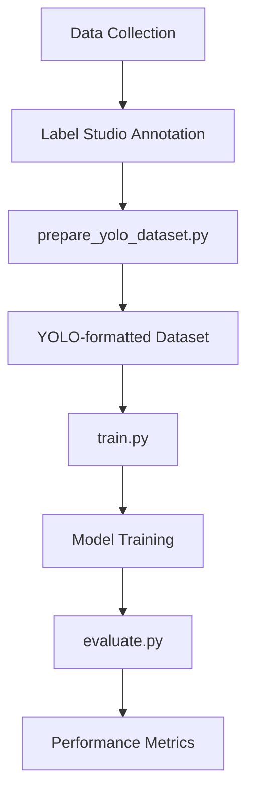

<div align="center">

# 🎯 Custom YOLOv8 Object Detection Pipeline  
**End-to-End Deep Learning for Real-World Applications**

A complete object detection solution using [Ultralytics YOLOv8](https://github.com/ultralytics/ultralytics) with custom dataset support, training, and evaluation.


</div>

---

<p align="center">
  <!-- Core Technologies -->
  
  
  
  
  <!-- Data Processing -->
  
  
  
  
  <!-- Annotation & Visualization -->
  
  
  
  
  <!-- Deployment & Monitoring -->
  
  
  
  
  <!-- Performance -->
  
  
  
  <!-- Project Info -->
  
  
  
</p>

---

## 📜 Project Overview

This pipeline provides a complete workflow for custom object detection:

1. **Dataset Collection**: Smartphone-captured images
2. **Annotation**: Label Studio for precise bounding boxes
3. **Preparation**: Auto-conversion to YOLO format
4. **Training**: Configurable YOLOv8 model training
5. **Evaluation**: Comprehensive metrics (mAP, PR curves)
6. **Deployment**: Ready-to-use model output

---
## 📸 Sample Outputs

<p align="center">
  
</p>

---

## 🌟 Key Features

- 📸 **Custom Dataset Support** - Use your own images
- 🏷️ **Label Studio Integration** - Streamlined annotation
- ⚙️ **Configurable Training** - Edit `config.yaml` for different models
- 📊 **Visual Evaluation** - PR curves, confusion matrices
- 🔄 **Reproducible** - Version controlled with requirements

---

## 📂 Project Structure



```text
project-root/
├── config.yaml                  # Training configuration
├── prepare_yolo_dataset.py      # Dataset preparation
├── training/
│   ├── train.py                 # Training script
│   └── my_model.pt             # Output model
├── evaluate.py                  # Evaluation script
├── data/                       # Organized dataset
│   ├── train/images/           # Training images
│   ├── train/labels/           # Training labels
│   ├── val/images/             # Validation images
│   ├── val/labels/             # Validation labels
│   └── data.yaml               # Dataset config
└── runs/                       # Training outputs
```

---

## 🛠️ Tech Stack

| Component       | Technology |
|----------------|------------|
| Framework      | YOLOv8 (PyTorch) |
| Annotation     | Label Studio |
| Data Processing | OpenCV, Pandas |
| Configuration  | YAML |
| Version Control | Git |

---

```bash
conda activate yolo-env1
pip install ultralytics opencv-python numpy
```

---

## 📌 Script Arguments

The script takes the following arguments:

| Argument       | Required | Description                                                                                                   |
| -------------- | -------- | ------------------------------------------------------------------------------------------------------------- |
| `--model`      | ✅ Yes    | Path to YOLO model file (`.pt`), e.g., `runs/detect/train/weights/best.pt`                                    |
| `--source`     | ✅ Yes    | Input source: image file (`test.jpg`), folder (`./images/`), video file (`video.mp4`), or USB webcam (`usb0`) |
| `--thresh`     | ❌ No     | Minimum confidence threshold for detections (default: `0.5`)                                                  |
| `--resolution` | ❌ No     | Output resolution in `WxH` format (e.g., `640x480`). Default is source resolution.                            |
| `--record`     | ❌ No     | Record results (only works with video or webcam). Saves to `demo1.avi`. Requires `--resolution`.              |

---

## 📌 Usage Examples

### 1. Run on a single image

```bash
python yolo_detect.py --model runs/detect/train/weights/best.pt --source test.jpg
```

### 2. Run on a folder of images

```bash
python yolo_detect.py --model runs/detect/train/weights/best.pt --source ./images/
```

### 3. Run on a video file

```bash
python yolo_detect.py --model runs/detect/train/weights/best.pt --source video.mp4
```

### 4. Run on a USB webcam

```bash
python yolo_detect.py --model runs/detect/train/weights/best.pt --source usb0 --resolution 640x480
```

### 5. Record results from webcam

```bash
python yolo_detect.py --model runs/detect/train/weights/best.pt --source usb0 --resolution 640x480 --record
```

---

## 📌 Controls During Inference

* Press **`q`** → Quit
* Press **`s`** → Pause inference
* Press **`p`** → Save current frame as `capture.png`

---


## 🚀 Getting Started

### ✅ Prerequisites
- Python 3.8+
- Ultralytics YOLOv8 (`pip install ultralytics`)
- Label Studio (for annotation)

### ⚙️ Setup
```bash
git clone https://github.com/shivamprasad1001/yolo-project.git
cd yolo-project
pip install -r requirements.txt
```

### � Dataset Preparation
1. Annotate images in Label Studio (YOLO format)
2. Export as `data.zip`
3. Run:
```bash
python prepare_yolo_dataset.py
```

### 🏋️ Training
Edit `config.yaml` then:
```bash
python training/train.py
```

### 📊 Evaluation
```bash
python evaluate.py
```

---

## ⚙️ Configuration (`config.yaml`)

```yaml
# Model configuration
model: yolov8n.pt        # yolov8n/s/m/l/x
data: data/data.yaml      # Dataset config
epochs: 50               # Training epochs
imgsz: 640               # Image size
batch: 16                # Batch size
project: runs/train      # Output directory
name: custom             # Run name
```

---

## 🔐 Security & Best Practices

- All training data remains local
- Model weights can be encrypted for deployment
- Git ignores sensitive training outputs

---

## 🚧 Future Roadmap

- [ ] TensorRT optimization for deployment
- [ ] Web-based annotation interface
- [ ] Automated hyperparameter tuning
- [ ] Docker support for easy setup

---

## 👨‍💻 Author

**Shivam Prasad**  
[GitHub](https://github.com/shivamprasad1001) | 
[LinkedIn](https://www.linkedin.com/in/shivamprasad1001)

---

## 📝 License

MIT License - See [LICENSE](LICENSE) for details.
